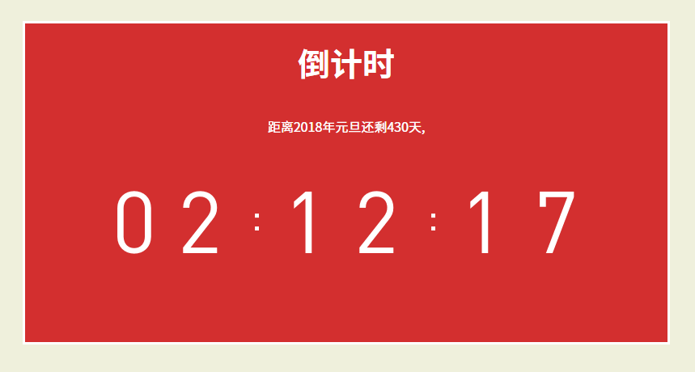

## React Countdown



### About
这是一个模仿“锤子科技”发布会倒计时的组件，因为觉得这是一个相当独立的组件，可以方便地复用，于是便使用React实现了一下，作为练习。

数字跳动使用背景的图片的移动。

### Setup

```
npm install
npm run test
```

### Usage

```
// 初始化一个标准时间为倒计时的终点
// 可以设置每一次计时长度step,默认为1s
// 可以设置相关信息

const ENDTIME = '1/1/2018 00:00 AM';
const OPTION = {
  endTime: ENDTIME,
  step: 1,
  imformation: '距离2018年元旦'
}

ReactDOM.render(
   <Countdown option={OPTION} />, document.getElementById('countdown'));
```

目前只提供了几个简单定制，以后如果有新的想法会继续完善。

### Demo

[Click here](http://drgao.xyz/countdown-react/)
